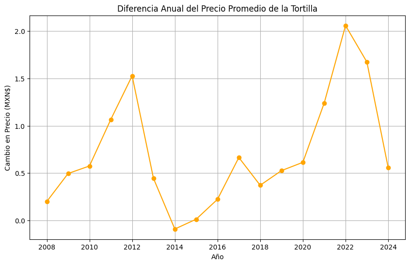
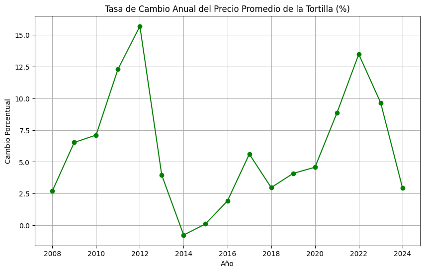
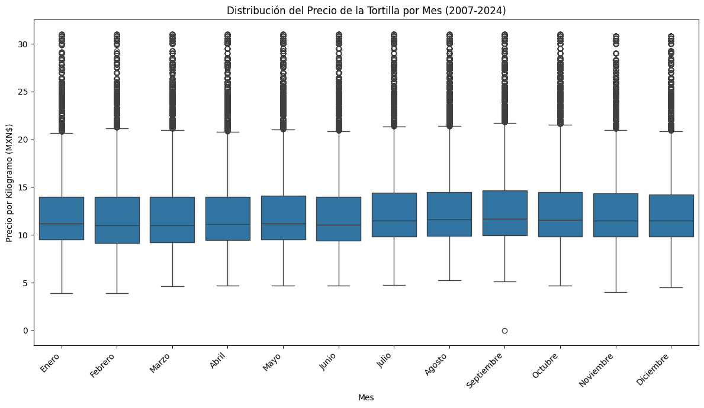

# 📊 Precio de las tortillas en México
# Análisis del Precio de las Tortillas en México 2007 - 2024

Este proyecto realiza un análisis exploratorio y descriptivo del precio de la tortilla en México. El conjunto de datos incluye información detallada sobre el precio por kilogramo de la tortilla en diversas ubicaciones (estados y ciudades) y tipos de tiendas a lo largo del tiempo, abarcando el periodo 2007-2024. 

---

## 📚 Tabla de Contenidos

- [🎯 Propósito](#-propósito)
- [📦 Conjunto de Datos](#-conjunto-de-datos)
- [🧪 Desarrollo del Proyecto](#-desarrollo-del-proyecto)
- [🛠️ Tecnologías](#-tecnologías)
- [⚙️ Instalación](#-instalación)
- [👤 Autor](#-autor)
- [📝 Licencia](#-licencia)

---

## 🎯 Propósito

Analizar la evolución del precio de las tortillas en México desde 2007 hasta 2024, identificando patrones temporales, diferencias regionales y factores que podrían haber influido en su comportamiento.

---

## 📦 Conjunto de Datos

El conjunto de datos utilizado contiene las siguientes columnas:
tortilla_price.csv:
- `State`: Estado de México donde se ubica la ciudad, los 32 estados de México están incluidos en el conjunto de datos.
- `City`: Principales ciudades de México donde se realizan escuentas de precios.
- `Year`: Año correspondiente a la observación.
- `Month`: Mes correspondiente a la observación.
- `Day`: Día correspondiente a la observación.
- `Store type`: Tipo de teinda de los precios encuentados (puede ser una tienda familiar o una gran tienda minorista).
- `Price per kilogram`: Estimación de precios para el tipo de tienda, día y ciudad encuestada.

Fuente: https://www.kaggle.com/datasets/richave/tortilla-prices-in-mexico.

---

## 🧪 Desarrollo del Proyecto

### **Carga y exploración inicial de los datos**
El proyecto comenzó con la obtención del conjunto de datos sobre los precios de la tortilla de maíz en México desde el año 2007 hasta el 2024, publicado en kaggle por 
*Rick Chavelas*. Se realizó una exploración preliminar para entender la estructura del dataset, la cantidad de registros, las variables disponibles, y la granularidad temporal y geográfica. Esta fase incluyó el uso de funciones como `.head()`, `.info()` y `.describe()` para detectar inconsistencias básicas y comprender las dimensiones generales del problema.

El problema identificando fue la falta de datos en la columna Price per kilogram
```python 
# Identificar valores nulos
print('Identificar Valores Nulos por Columnas')
valores_nulos = df_tortilla_price.isnull().sum()
print(valores_nulos)
```
```
Identificar Valores Nulos por Columnas
State                    0
City                     0
Year                     0
Month                    0
Day                      0
Store type               0
Price per kilogram    6390
dtype: int64
```
***Archivo: 1_EDA.ipynb***

### **Limpieza y preprocesamiento**
En la limpieza de los datos el un único problema crítico es: la presencia de valores nulos en la columna Price per kilogram. Debido a su relevancia central para el análisis, se decidió eliminar esos registros para mantener la integridad estadística del estudio. Otras columnas como las fechas y entidades se dejaron intactas en esta fase, ya que no presentaban problemas estructurales, y serían transformadas más adelante cuando fuera necesario.

Código para verificar la cantidad de filas y columnas
```python
# Verificar la cantidad de filas y columnas 
num_fias, num_columnas = df_tortilla_prices.shape
print(f'Número de filas: {num_fias}\nNúmero de columnas: {num_columnas}')
```
Salida:
```bash
Número de filas: 289146
Número de columnas: 7
```

Código para eliminar las filas con valores nulos:
```python
# Eliminar las filas con los valores nulos
df_tortilla_prices_sin_nulos = df_tortilla_prices.dropna()

# Verificar la cantidad de filas y columnas
num_filas_sin_nulos, num_columnas_sin_nulos = df_tortilla_prices_sin_nulos.shape
print(f'Número de filas: {num_filas_sin_nulos}\nNúmero de columnas: {num_columnas_sin_nulos}')
```
Salida:
```bash
Número de filas: 282756
Número de columnas: 7
```

Para finalizar la limpieza y preprocesamiento de los datos se guardaron los datos sin valores nulos en un nuevo archivo csv.
```python
df_tortilla_prices_sin_nulos.to_csv('../data/processed/tortilla_prices_sin_nulos.csv', index=False)
```
***Archivo: 2_limpieza_datos.ipynb***

### **Análisis exploratorio de datos (EDA)**
Con los datos limpios, se procedió a realizar un análisis exploratorio profundo para entender la distribución y evolución de los precios a lo largo del tiempo. Entre los principales hallazgos:

Se observó una tendencia general al alza en los precios promedio anuales de la tortilla.


Algunas entidades federativas destacan la presencia de precios sistemáticamente más altos y mínimos que otras, destacando diferencias regionales en 2007 y 2024.

Código:
```python
min_state_2007 = promedio_state_2007.idxmin()
min_precio_state_2007 = promedio_state_2007[min_state_2007]

max_state_2007 = promedio_state_2007.idxmax()
max_precio_state_2007 = promedio_state_2007[max_state_2007]


print('Esatdo del 2007 con precios Mínimos')
print(f'{"Estado":<11} Precio \n{min_state_2007:<11} ${min_precio_state_2007:.2f}')

print('\nEsatdo del 2007 con precios Máximos')
print(f'{"Estado":<11} Precio \n{max_state_2007:<11} ${max_precio_state_2007:.2f}')
```
Salida:
```bash
Estados del 2007 con precios Mínimos
Estado      Precio 
Oaxaca      $6.81

Estados del 2007 con precios Máximos
Estado      Precio 
Sonora      $8.56
```
Código:
```python
min_state_2024 = promedio_state_2024.idxmin()
min_precio_state_2024 = promedio_state_2024[min_state_2024]

max_state_2024 = promedio_state_2024.idxmax()
max_precio_state_2024 = promedio_state_2024[max_state_2024]

print('\nEsatdo del 2024 con precios Mínimos')
print(f'{"Estado":<11} Precio \n{min_state_2024:<11} ${min_precio_state_2024:.2f}')

print('\nEsatdo del 2007 con precios Máximos')
print(f'{"Estado":<11} Precio \n{max_state_2024:<11} ${max_precio_state_2024:.2f}')
```
Salida:
```bash
Estados del 2024 con precios Mínimos
Estado      Precio 
Tlaxcala    $15.35

Estados del 2007 con precios Máximos
Estado      Precio 
Sonora      $21.89
```

Esta visualización resalta los años en los que se produjeron cambios abruptos en el precio promedio de la tortilla. Los picos más altos, correspondientes a 2012, 2017, 2022 y 2023, indican aumentos anuales sustanciales, especialmente notable en 2022. La caída en 2014 señala una disminución en el precio promedio con respecto al año anterior.



La tasa de cambio anual del precio promedio de la tortilla muestra una volatilidad considerable a lo largo del periodo. Los incrementos porcentuales más pronunciados se dieron en 2012, 2017, 2022 y 2024, mientras que 2014 experimentó una disminución porcentual. El año 2024 presenta el mayor cambio relativo al año anterior.



Para detectar comportamientos inusuales en el precio promedio anual de la tortilla, se utilizaron dos enfoques. El primero, basado en el Rango Intercuartílico (IQR), identificó al año 2024 como un valor significativamente alejado del rango típico. El segundo método, que buscaba valores a más de 2 desviaciones estándar de la media, no encontró ningún año que cumpliera con este criterio de atipicidad.

```python
Q1 = promedio_anula.quantile(0.25)
Q3 = promedio_anula.quantile(0.75)
IQR = Q3 - Q1
limite_inferior = Q1 - 1.5 * IQR
limite_superior = Q3 + 1.5 * IQR
outliers_iqr = promedio_anula[(promedio_anula < limite_inferior) | (promedio_anula > limite_superior)]
print("Años con precios promedio atípicos (IQR):")
print(outliers_iqr)

media_precio = promedio_anula.mean()
desviacion_estandar = promedio_anula.std()
umbral = 2  # Puedes ajustar este valor
outliers_std = promedio_anula[abs(promedio_anula - media_precio) > umbral * desviacion_estandar]
print(f"\nAños con precios promedio que se desvían más de {umbral} desviaciones estándar:")
print(outliers_std)
```

```bash
Años con precios promedio atípicos (IQR):
Year
2024    19.564326
Name: Price per kilogram, dtype: float64

Años con precios promedio que se desvían más de 2 desviaciones estándar:
Series([], Name: Price per kilogram, dtype: float64)
```

El precio promedio mensual de la tortilla, promediado entre 2007 y 2024, presenta una variación relativamente suave a lo largo del año. La ausencia de una marcada estacionalidad podría deberse a la producción y disponibilidad continua del maíz y la tortilla a nivel nacional, así como a la influencia de otros factores económicos más dominantes que las posibles fluctuaciones estacionales en la oferta o la demanda.




### **Formulación y prueba de hipótesis**

#### **Hipótesis 1:**  *"El precio promedio de la tortilla ha aumentado significativamente en los últimos 10 años."*
* Se realizo una prueba t de muestras independientes comparando los precios promedio de los primeros 5 años con los últimos 5 años.

Código:
```python
# Filtra los datos para los primeros y últimos 5 años
primeros_5 = df_tortilla_prices[df_tortilla_prices['Year'].between(2007, 2011)]['Price per kilogram']
ultimos_5 = df_tortilla_prices[df_tortilla_prices['Year'].between(2020, 2024)]['Price per kilogram']
# Realiza la prueba t
t_stat, p_value = ttest_ind(primeros_5, ultimos_5, equal_var=False)
print(f'Estadístico t: {t_stat:.4f}, Valor p: {p_value}')
```
Salida:
```bash
Estadístico t: -429.1513, Valor p: 0.0
```
El **valor p** de **0.0** proporciona una evidencia estadística muy fuerte para concluir que existe una diferencia significativa en el precio promedio de la tortilla entre los primeros cinco años (2007-2011) y los últimos cinco años (2020-2024) del periodo analizado. El signo negativo del **estadístico t** indica que la media del segundo grupo (los últimos cinco años) es significativamente mayor que la media del primer grupo (los primeros cinco años), lo que respalda la hipótesis de que el precio promedio de la tortilla ha aumentado significativamente en los últimos 10 años.

#### **Hipótesis 2:** *"En el norte del país los precios son más altos que en el sur (Definir las regiones norte y sur según los estados correspondientes)."*
* Se realio una prueba t para comparar los precios promedio entre estas dos regiones.

```python
# Filtra los datos para los primeros y últimos 5 años
primeros_5 = df_tortilla_prices[df_tortilla_prices['Year'].between(2007, 2011)]['Price per kilogram']
ultimos_5 = df_tortilla_prices[df_tortilla_prices['Year'].between(2020, 2024)]['Price per kilogram']

# Realiza la prueba t
t_stat, p_value = ttest_ind(primeros_5, ultimos_5, equal_var=False)
print(f'Estadístico t: {t_stat:.4f}, Valor p: {p_value}')
```

```bash
Estadístico t: -429.1513, Valor p: 0.0
```
El **valor p** de **0.0005** proporciona evidencia estadística significativa para concluir que existe una diferencia en el precio promedio de la tortilla entre las regiones norte y sur de México. El signo positivo del **estadístico t** (asumiendo que la media de los precios del norte se colocó como el primer argumento en ttest_ind) sugiere que, en promedio, los precios de la tortilla son significativamente más altos en la región norte en comparación con la región sur, lo que respalda nuestra hipótesis inicial.

### **Factores que podrían influir en el aumento del precio de las tortillas**

El precio de la tortilla en México no es un valor aislado, sino el resultado de una compleja interacción de diversas fuerzas económicas, sociales y políticas. A continuación, exploramos algunos de los factores clave que podrían influir en las diferencias regionales y la tendencia general observada entre 2007 y 2024:

**Factores Macroeconómicos:**
- Inflación: La tendencia inflacionaria general del país es un impulsor fundamental del aumento de precios en bienes básicos.

**Factores de la Cadena de Suministro:**
- Precio del Maíz: Las fluctuaciones en los mercados nacionales e internacionales del maíz son un determinante directo del costo de producción.
- Costos de Producción y Operación: Incluyen energía (gas, electricidad), mano de obra, transporte y alquiler de locales.

**Factores Socioeconómicos y de Seguridad:**
- Crimen Organizado: La extorsión y la inseguridad pueden añadir costos significativos en ciertas regiones.
- Poder Adquisitivo del Consumidor: Aunque no causa directamente el aumento de precios, influye en la demanda y la capacidad de los consumidores para absorberlos.

**Factores Políticos y Regulatorios:**
- Políticas Agrícolas y Subsidios: Las decisiones gubernamentales en este ámbito pueden afectar la oferta y el precio del maíz.
- Regulaciones de Precios: Aunque limitadas, cualquier intervención gubernamental podría influir.

**Factores de Mercado:**
- Tipo de Tienda y Márgenes: Las diferencias en las estructuras de costos y las estrategias de precios entre los diferentes tipos de establecimientos.
- Oferta y Demanda Regional: Las condiciones locales pueden generar variaciones de precios entre estados.

Un análisis exhaustivo requerirá la exploración de datos sobre estos diversos factores a lo largo del periodo estudiado para identificar correlaciones y posibles relaciones causales.

### **Conclusión**
El análisis confirma que el precio de la tortilla en México ha aumentado consistentemente desde 2007, con una mayor aceleración en la última década. Existen diferencias regionales claras, con precios más elevados en el norte del país. Además, la variabilidad entre estados se ha incrementado, lo que puede reflejar desigualdades económicas, logísticas o políticas en las cadenas de distribución.

---

## 🛠️ Tecnologías

- Python
- Pandas
- Matplotlib
- Seaborn
- Jupyter Notebook

---

## ⚙️ Instalación

### 1. Clonar este repositorio:
```bash
git clone https://github.com/SaitoM17/analisis_del_precio_tortillas_mexico_2007_a_2024.git
```
### 2. Uso de un Entorno Virtual para Aislar Dependencias

Para evitar conflictos con versiones de librerías, se recomienda usar entornos virtuales.

####  Crear y Activar un Entorno Virtual

##### Crear el entorno virtual:
```
python -m venv venv
```
##### Activar el entorno:
* #### En Windows:

    ```
    venv\Scripts\activate
    ```

* #### En Mac/Linux::

    ```
    source venv/bin/activate
    ```
#### 3. Instalar dependencias dentro del entorno:
* #### Opición 1:
    ```
    pip install -r requirements.txt
    ```

* #### Opción 2 (De forma manual):
    ```
    pip install numpy pandas matplotlib seaborn scikit-learn
    ```
---

## 👤 Autor

**Said Mariano Sánchez** – *smariano170@gmail.com*  
Este proyecto forma parte de mi portafolio como analista de datos Jr.

---

## 📝 Licencia

Este proyecto está licenciado bajo la **Licencia MIT**. Puedes usarlo, modificarlo y distribuirlo libremente, siempre que menciones al autor original.

---